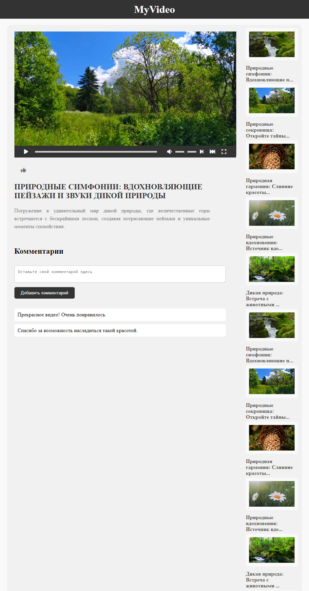

# [Видео плеер](https://asalferova.github.io/VideoPlayer/ "Ссылка на сайт")

## Описание проекта

Интерактивный видеоплеер с возможностью просмотра различных видео. Пользователь может просматривать видео, управлять воспроизведением, переключаться между видео, а также оставлять комментарии.

## Технологии

            

## Особенности проекта

   * Проект демонстрирует понимание работы с **HTMLMediaElement**. Тут используются различные свойства (playbackRate, volume, currentTime, duration) и методы (play, pause), а также обрабатываются события (timeupdate, click), чтобы создать полнофункциональный видеоплеер.
   * В Проекте используются концепции **объектно-ориентированного программирования**. 
   * **Имитация сервера**: Для имитации взаимодействия с сервером используется объект server с методом getVideos, который возвращает промис. Это позволяет имитировать асинхронную загрузку данных с сервера.
   * **Throttling**: Используется функция throttle для ограничения частоты вызова функции, что помогает улучшить производительность при обработке событий прокрутки или изменения размера окна.
   * **JavaScript ES6+**: Проект использует классы, стрелочные функции, промисы, деструктуризацию объектов.

Проект разработан для демонстрации навыков в области веб-разработки, включая работу с DOM, обработку событий, асинхронное программирование. 

## Скриншоты сайта

Здесь представлен скриншот сайта:

